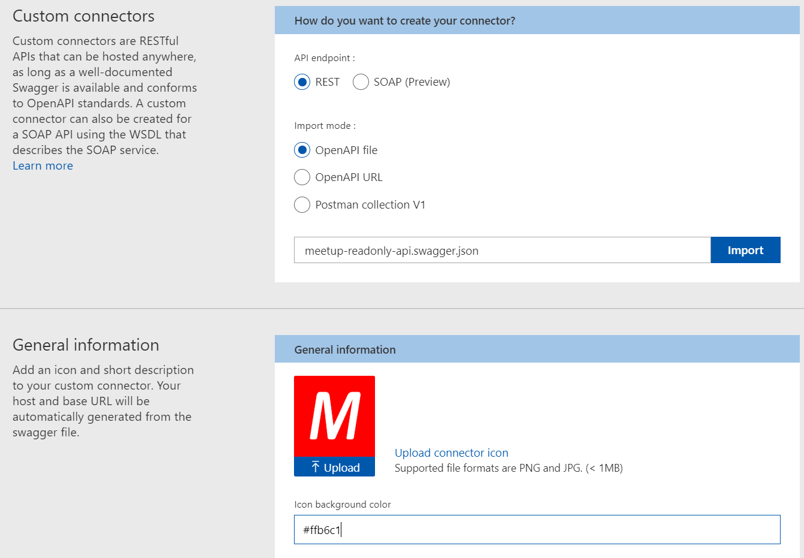

# Logic Apps Meetup Read-only Public API Connector

This repository contains the definition for an Azure Logic Apps Custom Connector for Meetup's REST API, the details of which you can find at https://www.meetup.com/meetup_api/.

> Note: this is not a Meetup authored or maintained Connector. Use at your own risk!

The following v3 API methods have been implemented:

- [Get Group](https://www.meetup.com/meetup_api/docs/:urlname/#get)
- [Group Events](https://www.meetup.com/meetup_api/docs/:urlname/events/#list)
- [Get Event](https://www.meetup.com/meetup_api/docs/:urlname/events/:id/#get)

If you wish to populate additional fields in the responses then make sure you read the API docs and set the correct values in the 'fields' request parameter that is available as part of the Connector implementation.

### Throttling

This Connector will be subjected to the standard Meetup API throttling behaviour (429 Too Many Requests) which you can read more about on the [Meetup API documentation site](https://www.meetup.com/meetup_api/docs/#limits).

### Importing the Connector

You can use this Connector in your own environment by choosing to create a Logic App Custom Connector as per [the documentation](https://docs.microsoft.com/en-us/connectors/custom-connectors/create-logic-apps-connector) and then importing the [Meetup-Readonly-API.json](Meetup-Readonly-API.json) file as per the documentation on [creating Custom Connectors using OpenAPI defintions](https://docs.microsoft.com/en-us/connectors/custom-connectors/define-openapi-definition).

If you want to create a nice rounded experience you can use the logo.png file in this repository and then setting a background colour of #FFB6C1 (which is light pink).

